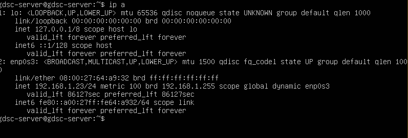
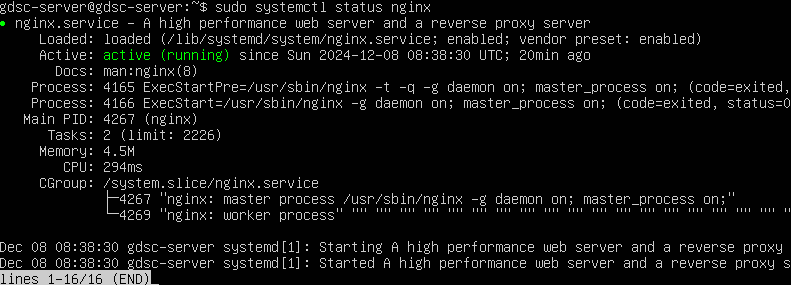
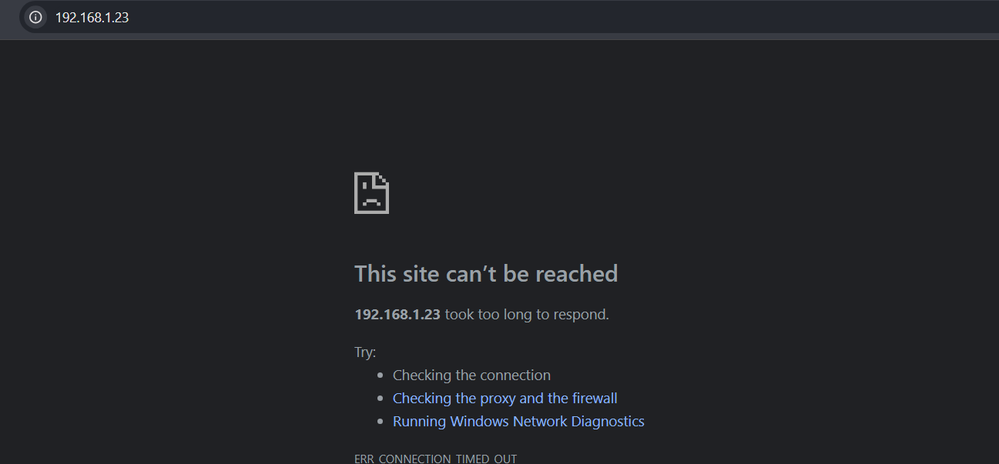
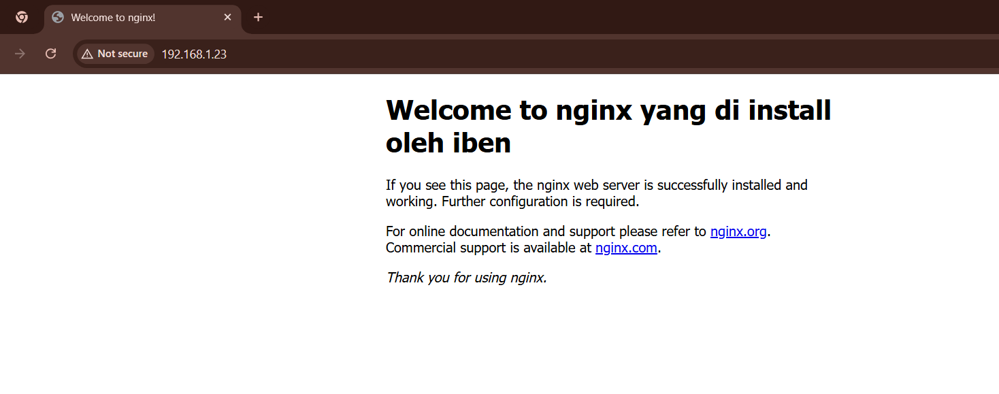

# 📘 **Membuat Virtual Machine (VM) dan Konfigurasi Nginx Web Server**

**Deskripsi Singkat:**  
Panduan Dasar cara membuat Virtual Machine (VM) menggunakan VirtualBox, menginstal OS Ubuntu, dan mengonfigurasi Nginx sebagai Web Server.

---

## 📜 **Daftar Isi**
1. Download & Instal VirtualBox
2. Download File ISO Ubuntu Server]
3. Membuat Virtual Machine di VirtualBox
4. Instalasi dan Konfigurasi Nginx Web Server
5. Konfigurasi Firewall

---

### 🔧 **Teknologi yang Digunakan**
Unduh dan instal tools berikut sebelum memulai:

- [VirtualBox](https://www.virtualbox.org/wiki/Downloads)
- [Ubuntu Server Versi 22.04.5 LTS](https://ubuntu.com/download/server/thank-you?version=22.04.5&architecture=amd64&lts=true)

---

## 🛠 **Instalasi Prasyarat**
Sebelum memulai, pastikan Anda telah memenuhi persyaratan berikut:

1. **VirtualBox** sudah terinstal di komputer Anda.
2. **ISO Ubuntu Server** sudah diunduh.

---

## Langkah 1: **Membuat Virtual Machine (VM)**

### 1. Pilih Nama & OS
1. **Buka VirtualBox** dan klik `New`.
2. **Name**: `gdsc-server` (Nama bebas sesuai keinginan Anda).
3. **Type**: Pilih `Linux`.
4. **Version**: Pilih `Ubuntu (64-bit)`.
5. Pilih "Choose a disk file" dan pilih file ISO Ubuntu yang telah diunduh.

### 2. Konfigurasi Resource VM
1. **Memory Size**: Minimal `1GB (1024 MB)`, disarankan `2GB`.
2. **Hard Disk**: Pilih "Create a virtual hard disk now", dengan ukuran minimal `20 GB`.

### 3. Mulai VM
Klik tombol `Start` dan ikuti proses instalasi Ubuntu.

> ⚠️ **Catatan Penting:**  
> Proses instalasi akan memakan waktu beberapa menit, harap bersabar.

---

### Setelah Instalasi Selesai
Login menggunakan **Username** dan **Password** yang telah Anda buat.

---

## Langkah 2: **Instalasi dan Konfigurasi Nginx Web Server**

### 1. Cek IP Address dari VM
Gunakan perintah berikut untuk melihat IP address VM:

```bash
# Cek IP
ip addr

```
### Output :

- Catat IP address yang terhubung ke jaringan lokal (biasanya pada bagian interface eth0 atau `enp0s3` perhatikan di bagian `inet`).
##### 

> ⚠️ **Catatan Penting:**
> Pastikan di Terminal dapat melakukan ping ke domain google, untuk memeriksa konektivitas dari jaringan sehingga dapat mengupdate package.
```bash
# ping domain google.com
ping google.com
```

#### 1. Update Sistem
```bash
# Mengupdate Sistem
sudo apt update && sudo apt upgrade -y
```
#### 2. Instal Nginx
```bash
# Install Nginx
sudo apt install nginx -y
```
#### 3. Jalankan dan Aktifkan Nginx
```bash
# Cek status Nginx
sudo systemctl status nginx
```
```bash
# Menajalankan Nginx
sudo systemctl start nginx
```
```bash
# NGINX akan otomatis dijalankan
sudo systemctl enable nginx
```
#### Jika berhasil maka tampilan akan seperti gambar di bawah!


##### 4. Akses Nginx menggunakan `IP` VM



> ⚠️ **Catatan Penting:**
> Nginx Web Server yang kita buat tidak dapat di akses padahal status   Nginx sudah `Running` , Kita harus memperhatikan firewall dari VM dengan memastikan `PORT 80` sudah di Izinkan.
----

## Langkah 3. Konfigurasi Firewall
#### 5. Menyesuaikan Firewall

```bash
# perintah ufw
sudo ufw app list
```
```bash
# Outputnya akan terlihat seperti ini!
Available applications:
  Nginx Full
  Nginx HTTP
  Nginx HTTPS
  OpenSSH
```
#### Penjelasan:
1. Nginx Full: Web server lengkap untuk HTTP dan HTTPS.
2. Nginx HTTP: Menangani trafik HTTP biasa (tanpa enkripsi) dengan PORT `80`
3. Nginx HTTPS: Menangani trafik HTTPS yang aman dengan enkripsi dengan PORT `443`
4. OpenSSH: Alat untuk mengakses server dan mentransfer data dengan aman dengan Port `22`

### Karena disini kita akan mennggunakan HTTP sebagai Traffic server maka kita akan mengaktifkan Port `80`

```bash
# perintah ufw
sudo ufw allow 'NGINX HTTP'
```

```bash
# Untuk melihat Status Firewall
sudo ufw status
```

```bash
Output
Status: active


To                         Action      From
--                         ------      ----
OpenSSH                    ALLOW       Anywhere                  
Nginx HTTP                 ALLOW       Anywhere                  
OpenSSH (v6)               ALLOW       Anywhere (v6)             
Nginx HTTP (v6)            ALLOW       Anywhere (v6)
```
Untuk melihat apakah konfigurasi kita berhasil, kita dapat membuka di web browser dengan memasuukan :

```bash
http://ip-server dari VM
```
### Output :


### Part Tantangan :
#### Kita akan mengedit halaman Welcome Page dari Nginx.

 ```bash
sudo nano /var/www/html/index.nginx-debian.html 
```

Tekan Ctrl + O di nano untuk menyimpan perubahan, lalu Ctrl + X untuk keluar.

```bash
sudo systemctl restart nginx

```
Buka browser kembali dan akses alamat server
```bash
http://server_ip_or_domain

```